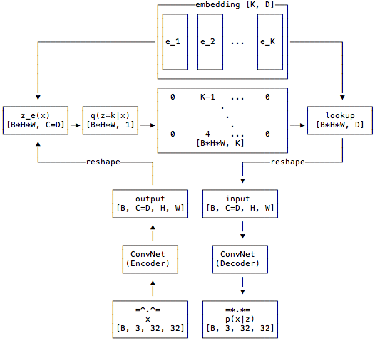
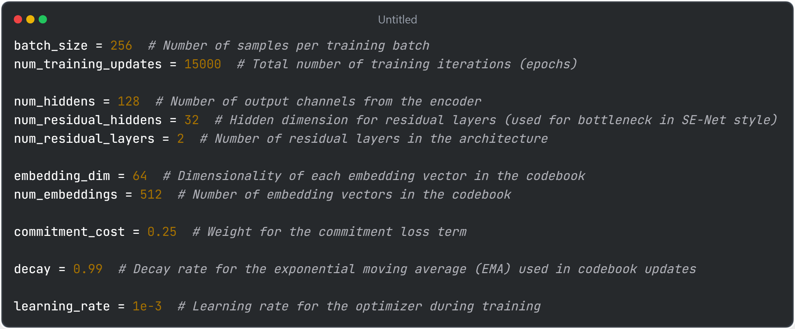
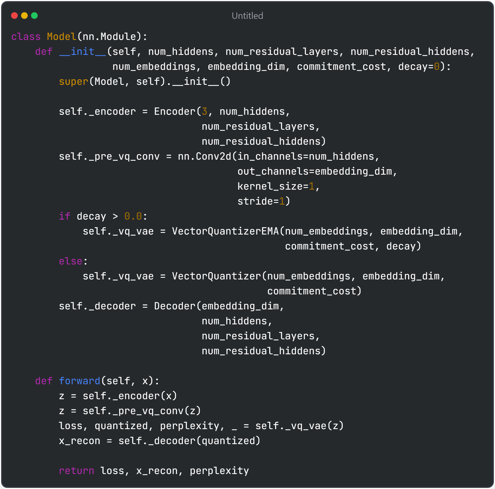
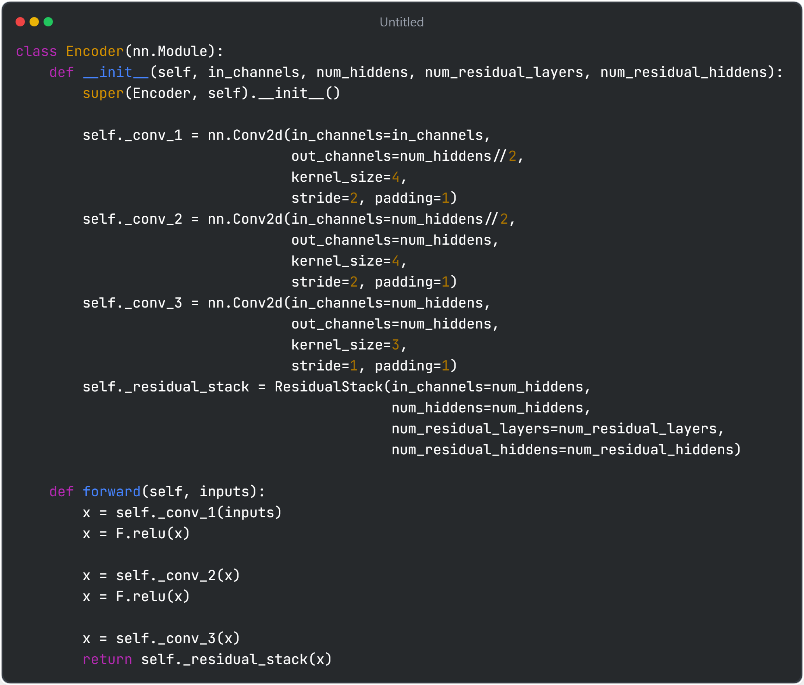
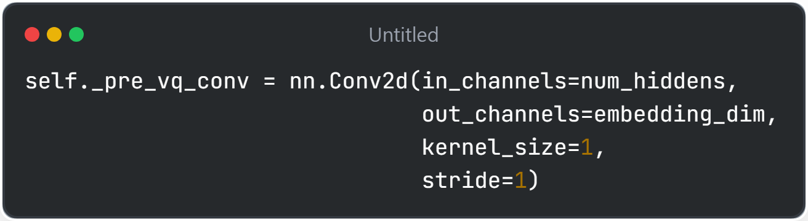
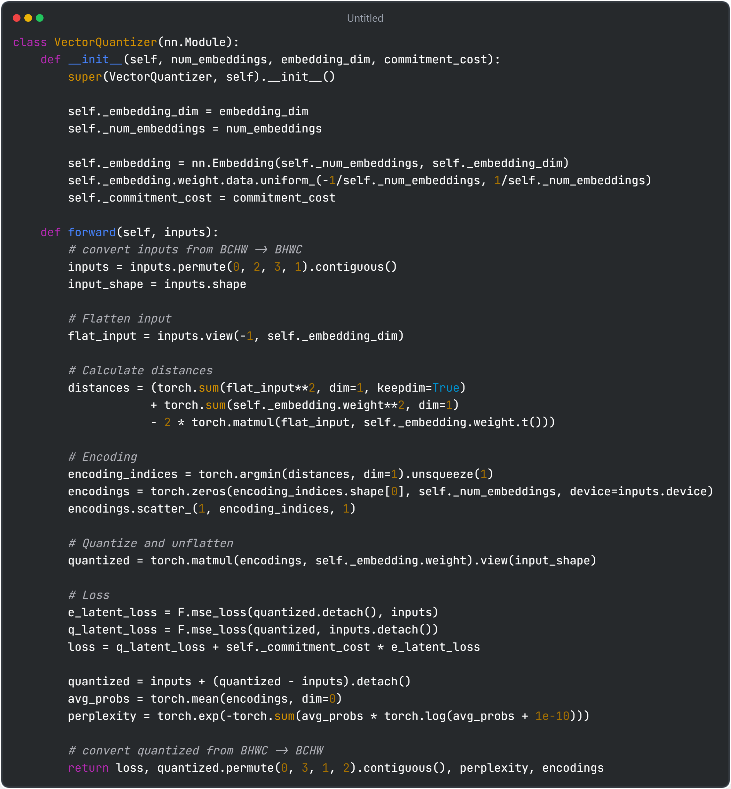
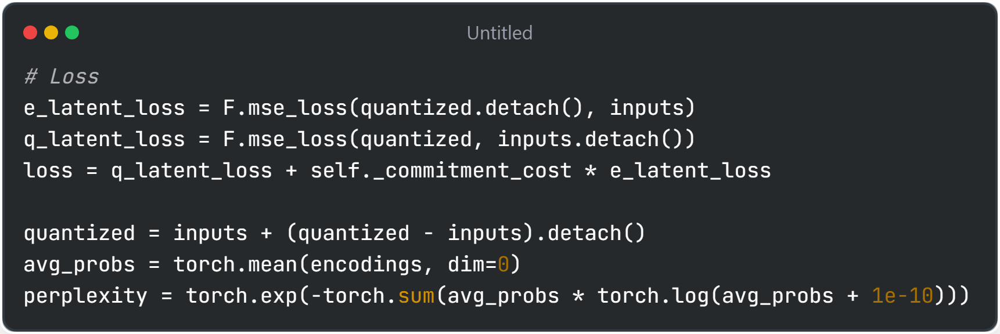
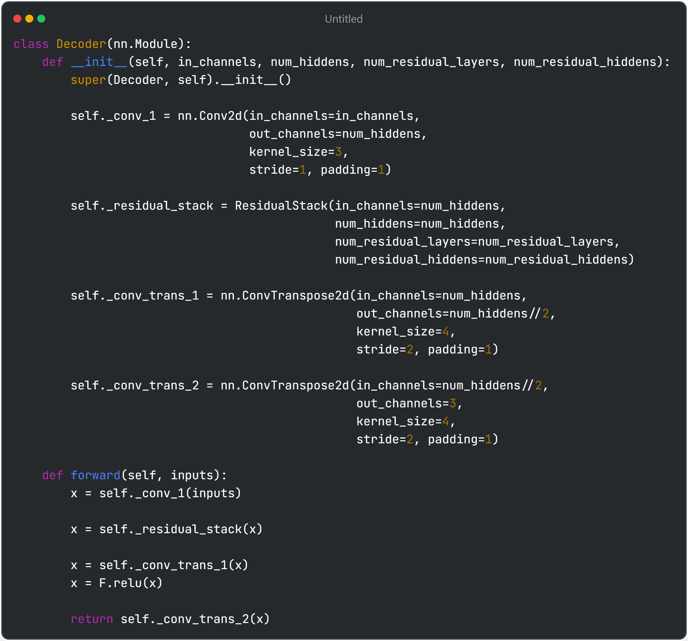
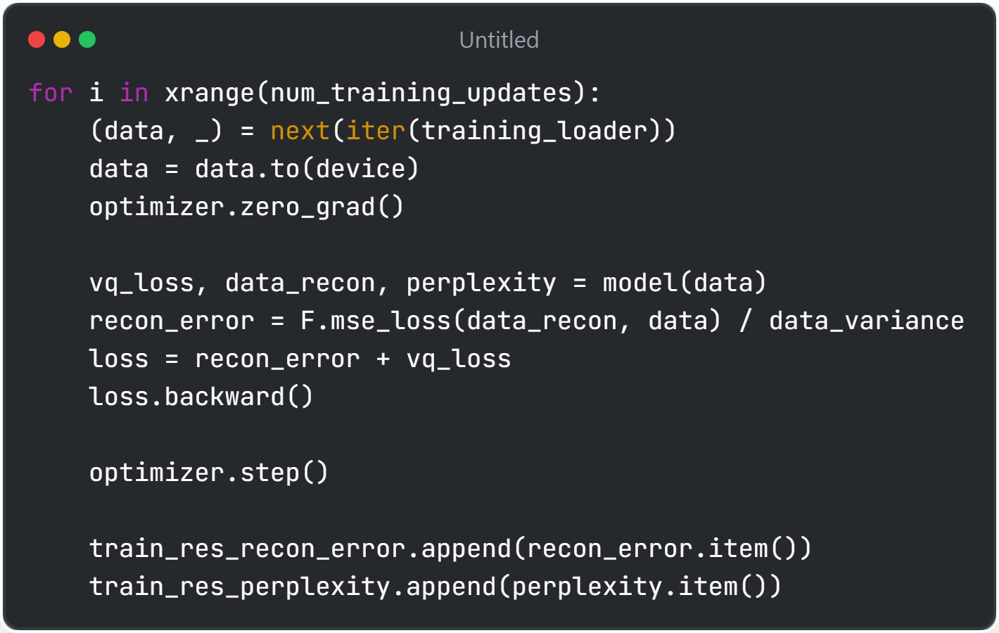

# VQ-VAE code analysis
### tl;dr VQ-VAE quatize encoded vector into codebook, which adapts to transformer (VLMS, LLMS etc.)
### Analysis on reimplemented Pytorch code @ https://github.com/zalandoresearch/pytorch-vq-vae

| 
Image
 | Description |
|-------------------------------------------------|-------------------------|
|  | Hyperparameters used for vqvae, explanataion in comments |
|  | Overall model architecture of vqvae model. Composed of four sections 1. Encoder: input images are encoded into feature vectors 2. pre_vq_conv: Reduce channel size of encoder output to embedding_dim 3. vq_vae: Quanization of encoded vector 4. decoder: Decode quantized vector into reconstructed image|
|  | Encoder: 3 conv layers + RELU activation + residual connection Reduce height/width and increase channel size to num_hiddens |
|  | 1x1 convolution that reduces channel size from num_hiddens to embedding_dim |
|  | **Quantization layer maps continuous latent vector to discrete embeddings from codebook**   1. Embedding codebook vector is initialized uniformly with small range (-1/codebook_size, 1/codebook_size) 2. Encoded input are reshaped and flattened to 2d tensor flat_input i.e. B * embed_dim * H * W -> (B * H * W) * embed_dim 3. Euclidean distance between codebook vectors and flattened 2d tensors are calculated. In code $(embedvec - flatvec)^2 = (embedvec)^2 + (flatvec)^2 - 2 * embedvec * flatvec$ rule is applied. distance.shape = (B * H * W) * codebook_size 4. For each input tensor, nearest codebook embedding vector is found based on minimum distance. One-hot encoding sparse matrix is created using scatter_(). encodings.shape = (B * H * W) * codebook_size where each encodings have 1 on closest codebook vector and 0 otherwise 5. Replace each one hot encoding into actual codebook vector by multiplication, then reshape into original dimensions. quantized.shape = B * embed_dim * H * W|
|  | Loss function in quanization layer. vq_vae overall has three losses 1. Reconstruction loss 2. e_latent_loss 3. q_latent_loss. Here loss #2 and 3 are defined - Two losses are defined to minimize the difference between quanized codebook vector and encoded vector. Therefore, reduce the information loss due to quantization. - e_latent_loss updates the encoder parameter by stopping gradient of quanized vector. This loss has small weight (defined by commitmnet_cost) because reconstruction loss also updates the encoder parameter - q_latent_loss updates codebook quantized vector by stopping gradient of inputs. NOTE: if two losses have same importance(weight), they can be merged into single loss i.e. F.mse_loss(quantized, inputs) - Straight through estimator trick: inputs + (quantized - inputs).detach() passes quantized in forward step, while backpropogate inputs in backward step. This is because input -> quantized step for searching minimum distance is not differentiable.|
|  | Decoder: 2 tranposed convolution layer + RELU activation + residual connection  Decode quantized vectors into input shape recontructed image|
|  | Training code. Here, our last loss recon_error is added to compute final loss Perplexity mesarues how uniformly codebook embeddings are being used|

